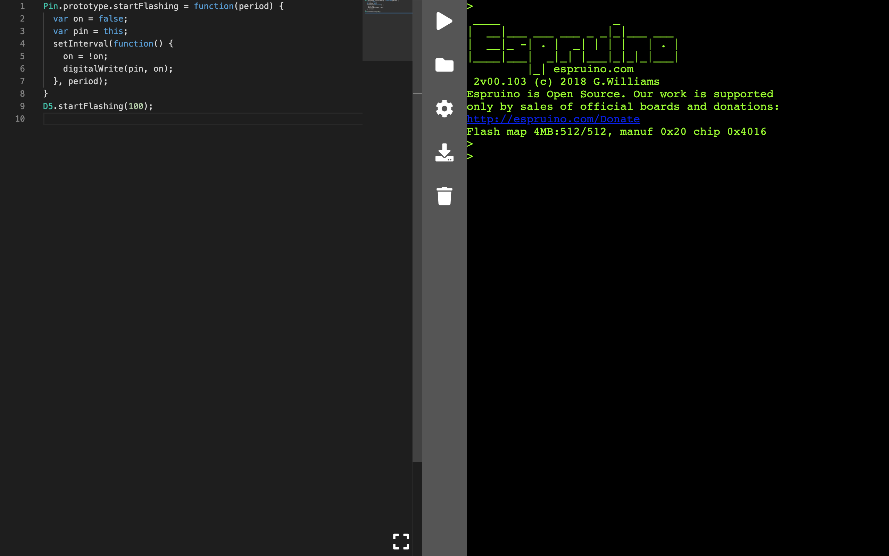
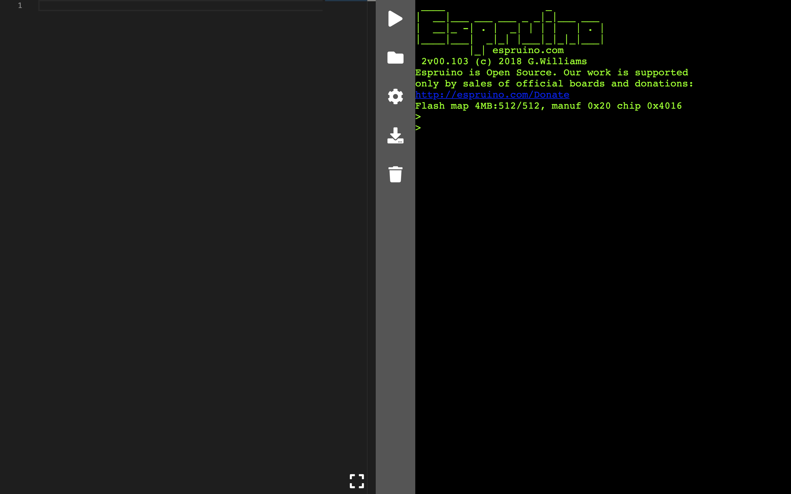
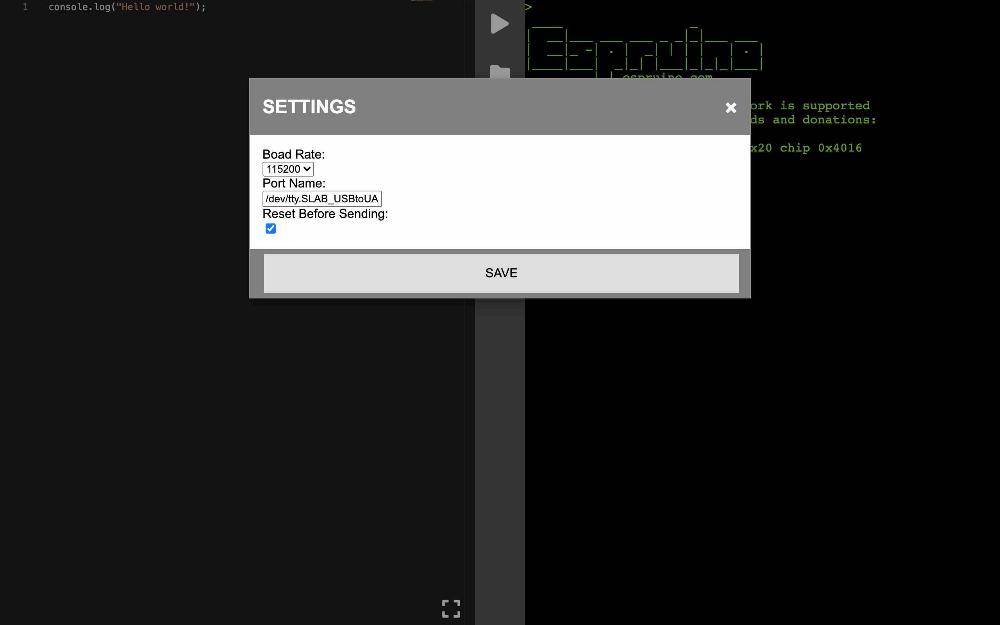

# MOTINO
Espruino IDE built with Electron, Monaco and Espruino.

### Getting Start
Install dependencies 

`npm install`

Build electron with Espruino:

`npm run rebuild`

Run electron

`npm run start`

### Screenshots

Home

Editor

Running

Settings

### TODO

- [x] Reset on write
- [ ] Interactive shell
- [x] Format console response
- [ ] Allow flashing
- [ ] List available ports
- [ ] Generate packages